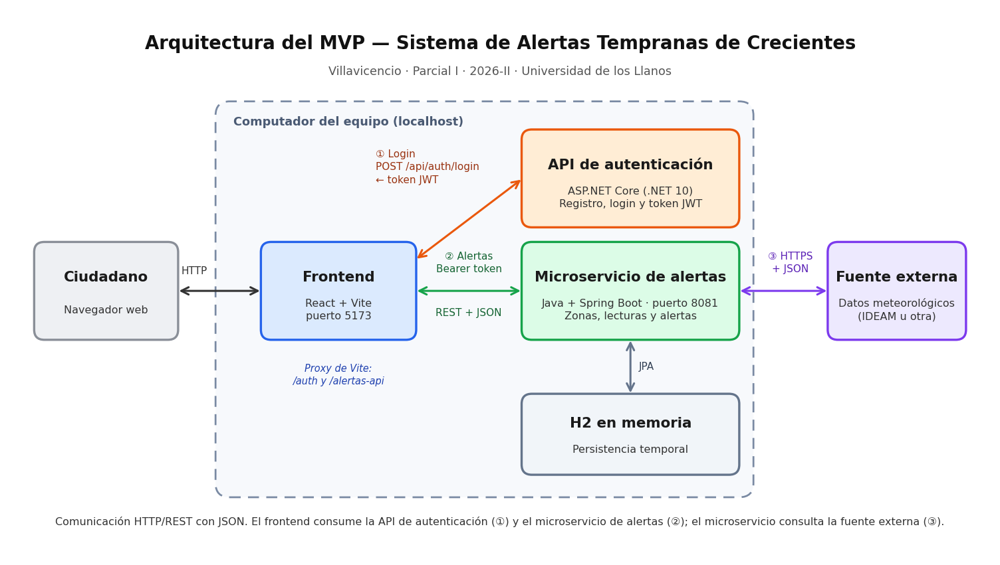

# Sistema de Alertas Tempranas de Crecientes — Villavicencio

* **Asignatura:** Teleco 1 · Parcial I · 2026-II
* **Institución:** Universidad de los Llanos (FCBI, Ingeniería de Sistemas)

## Integrantes
| # | Integrante | Rol principal |
|---|---|---|
| 1 | Alex Pérez Pedraza | Frontend: Pantalla de login e integración con API de autenticación |
| 2 | Brayan Espitia | Frontend: Vista de alertas y consumo de microservicio |
| 3 | Nicolás Villarraga | Microservicio de alertas: Endpoints, modelo y umbrales |
| 4 | Eduar Murcia | Consumo de datos externos (IDEAM), diagramas y README |

## Estructura del Proyecto
