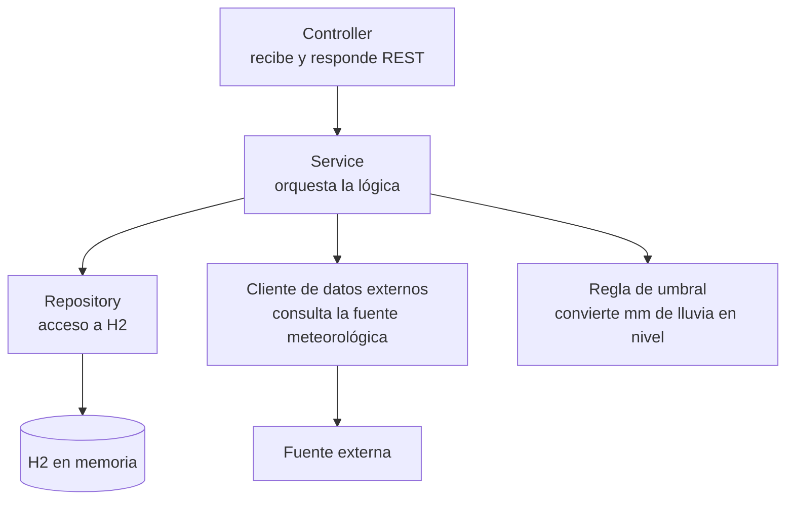
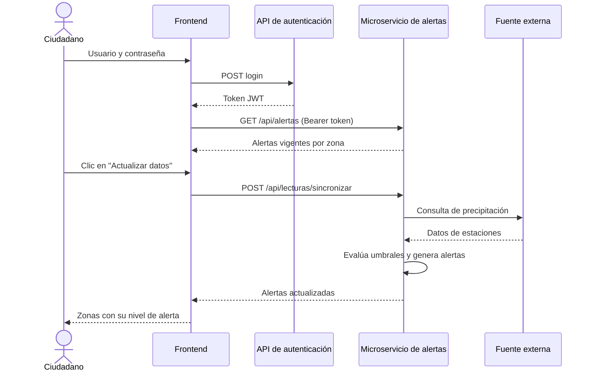

# Diseño de aplicación

**Proyecto:** Sistema de Alertas Tempranas de Crecientes — Villavicencio
**Asignatura:** Telemática 1 · Parcial I · 2026-II · Universidad de los Llanos
**Ubicación en el repositorio:** `docs/aplicacion.md`

---

## 1. Objetivo

Describir qué hace el sistema desde el punto de vista del usuario y cómo está organizado por dentro: pantallas del frontend, capas del microservicio de alertas, endpoints y reglas de negocio. Los valores marcados como **[completar]** se cierran durante la implementación.

---

## 2. Funcionalidad del MVP

### 2.1 Actor

| Actor | Descripción |
|---|---|
| Ciudadano | Persona de una comunidad cercana a un río o caño de Villavicencio que consulta el estado de riesgo de su zona. Debe iniciar sesión para usar el sistema |

### 2.2 Casos de uso

| Código | Caso de uso | Servicio que lo atiende | Resultado |
|---|---|---|---|
| CU-01 | Iniciar sesión | API de autenticación | El usuario obtiene un token y accede a la pantalla de alertas |
| CU-02 | Consultar alertas vigentes por zona | Microservicio de alertas | El usuario ve cada zona con su nivel de alerta |
| CU-03 | Actualizar datos de lluvia | Microservicio de alertas | El sistema consulta la fuente externa, evalúa los umbrales y refresca las alertas |

El **CU-03 es la funcionalidad de negocio** que se demuestra en la sustentación después del login: es el flujo del segundo servicio que el PDF exige poder ejecutar desde el frontend.

### 2.3 Niveles de alerta

| Nivel | Significado | Color en pantalla |
|---|---|---|
| `NORMAL` | Lluvia dentro de lo habitual; sin riesgo de creciente | Verde |
| `PRECAUCION` | Lluvia acumulada relevante; se recomienda estar atento | Amarillo |
| `PELIGRO` | Lluvia intensa; posible creciente, se recomienda prepararse para evacuar | Rojo |

Una zona que aún no tiene lecturas se muestra como "Sin datos" en gris. No es un nivel de alerta, sino un estado de pantalla que indica que falta pulsar "Actualizar datos".

### 2.4 Fuera de alcance del MVP

- Notificaciones por SMS, correo o aplicación móvil.
- Mapas interactivos.
- Roles y administración de zonas o usuarios.
- Histórico y estadísticas de lluvias.
- Actualización automática programada.

Estos puntos pueden formar parte de la entrega final del curso, pero no del parcial.

---

## 3. Frontend

Tecnología: React con Vite. El frontend solo presenta información y llama a los servicios; **no contiene lógica de negocio** (no decide niveles de alerta).

### 3.1 Pantallas

| Pantalla | Ruta | Acceso | Función |
|---|---|---|---|
| Login | `/login` | Público | Formulario de usuario o correo y contraseña |
| Alertas | `/alertas` | Solo con sesión iniciada | Lista de zonas con su nivel, botón "Actualizar datos" y botón "Cerrar sesión" |

La ruta `/` redirige a `/alertas` si hay sesión, o a `/login` si no la hay.

### 3.2 Comportamiento de cada pantalla

**Login**

1. El usuario escribe usuario o correo y contraseña.
2. Si algún campo está vacío, se muestra un mensaje y no se envía la petición.
3. Se llama al login de la API de autenticación.
4. Si es exitoso, se guarda el token en `sessionStorage` y se navega a `/alertas`.
5. Si falla, se muestra "Credenciales incorrectas" (o "No se pudo conectar con el servicio" si no hubo respuesta).
6. Mientras espera la respuesta, el botón queda deshabilitado.

**Alertas**

1. Al abrir la pantalla, consulta las alertas vigentes (CU-02).
2. Muestra una tarjeta por zona con su nombre, cuerpo de agua, comunidades, nivel (con color), precipitación y fecha y hora de la última actualización.
3. El botón "Actualizar datos" ejecuta el CU-03 y, al terminar, vuelve a mostrar la lista.
4. "Cerrar sesión" borra el token y regresa a `/login`.

Estados que debe manejar la pantalla de alertas:

| Estado | Qué se muestra |
|---|---|
| Cargando | Indicador de carga |
| Sin datos | Zonas en gris con el texto "Sin datos; pulse Actualizar datos" |
| Con datos | Tarjetas de color según el nivel |
| Error | Mensaje claro y las alertas anteriores, si las había |

### 3.3 Organización del código

```
frontend/src/
├── pages/
│   ├── LoginPage.jsx
│   └── AlertasPage.jsx
├── components/
│   ├── ZonaCard.jsx          # Tarjeta de una zona con su color de nivel
│   └── RutaProtegida.jsx     # Redirige a /login si no hay token
├── services/
│   ├── authService.js        # Llamadas a la API de autenticación
│   └── alertasService.js     # Llamadas al microservicio de alertas
├── App.jsx                   # Definición de rutas
└── main.jsx
```

| Módulo | Responsabilidad |
|---|---|
| `authService` | Login y manejo del token (guardar, leer, borrar) |
| `alertasService` | Consultar alertas y pedir la actualización, enviando `Authorization: Bearer <token>` |
| `RutaProtegida` | Impedir el acceso a `/alertas` sin token |
| `ZonaCard` | Mostrar una zona; es el único lugar donde se traduce el nivel a un color |

Las páginas no llaman directamente a `fetch`: lo hacen a través de los servicios. Así, si cambia una ruta de un servicio, solo se modifica un archivo.

### 3.4 Rutas que usa el frontend

Gracias al proxy descrito en el documento de infraestructura, el navegador solo llama a su propio origen:

| Acción | Ruta que llama el navegador | Servicio de destino |
|---|---|---|
| Login | `POST /auth/api/auth/login` | API de autenticación |
| Consultar alertas | `GET /alertas-api/api/alertas` | Microservicio de alertas |
| Actualizar datos | `POST /alertas-api/api/lecturas/sincronizar` | Microservicio de alertas |

---

## 4. Microservicio de alertas

Tecnología: Java con Spring Boot, Spring Web, Spring Data JPA y H2 en memoria. Es el servicio de dominio del proyecto.

### 4.1 Capas



| Capa | Responsabilidad | No debe hacer |
|---|---|---|
| Controller | Recibir peticiones HTTP, validar lo básico y devolver JSON con el código HTTP correcto | Contener lógica de negocio ni acceder a la base de datos |
| Service | Coordinar el proceso: pedir datos, evaluar el nivel, guardar lecturas y alertas | Conocer detalles de HTTP ni del formato de la fuente externa |
| Repository | Leer y escribir en H2 | Tomar decisiones de negocio |
| Cliente de datos externos | Consultar la fuente meteorológica y traducir su respuesta al modelo propio | Guardar datos |
| Regla de umbral | Convertir la precipitación en un nivel de alerta | Consultar bases de datos o servicios |

### 4.2 Organización del código

Paquete base: **[completar]** (por ejemplo, `co.edu.unillanos.sisalert.alertas`).

```
alertas-service/src/main/java/<paquete base>/
├── controller/     ZonaController, AlertaController, LecturaController
├── service/        ZonaService, AlertaService, SincronizacionService
├── repository/     ZonaRepository, LecturaRepository, AlertaRepository
├── model/          Zona, Lectura, Alerta, NivelAlerta (enum)
├── client/         ClienteDatosExternos (interfaz) y su implementación
├── rules/          ReglaDeUmbral
├── dto/            Objetos que se devuelven por la API
└── config/         Carga inicial de zonas y lectura de umbrales
```

Que el cliente de datos externos sea una **interfaz** permite cambiar de fuente (IDEAM u otra) sin tocar el resto del servicio, y simular la fuente en las pruebas.

### 4.3 Datos iniciales

Al arrancar, el servicio carga entre 3 y 4 zonas de ejemplo en H2. Las zonas y estaciones concretas se definen en el Paso 4 **[completar]**. El detalle de los campos está en `docs/modelo-datos.md`.

---

## 5. Endpoints del microservicio de alertas

Todos los endpoints devuelven JSON. Prefijo común: `/api`.

| Método | Ruta | Descripción | Caso de uso |
|---|---|---|---|
| GET | `/api/zonas` | Lista de zonas de riesgo | Apoyo a CU-02 |
| GET | `/api/alertas` | Alerta vigente de cada zona | CU-02 |
| POST | `/api/lecturas/sincronizar` | Consulta la fuente externa, guarda lecturas y regenera alertas | CU-03 |

### 5.1 `GET /api/zonas`

Respuesta `200 OK`:

```json
[
  {
    "id": 1,
    "nombre": "Zona de ejemplo 1",
    "cuerpoAgua": "Caño de ejemplo",
    "comunidades": "Barrio A, Barrio B"
  }
]
```

### 5.2 `GET /api/alertas`

Devuelve una entrada por zona. Si la zona no tiene alerta todavía, `nivel` llega como `null` y el frontend muestra "Sin datos".

Respuesta `200 OK`:

```json
[
  {
    "zonaId": 1,
    "zona": "Zona de ejemplo 1",
    "cuerpoAgua": "Caño de ejemplo",
    "comunidades": "Barrio A, Barrio B",
    "nivel": "PELIGRO",
    "mensaje": "Lluvia intensa. Prepárese para una posible evacuación.",
    "precipitacionMm": 62.5,
    "fechaHora": "2026-10-01T15:30:00"
  }
]
```

### 5.3 `POST /api/lecturas/sincronizar`

No requiere cuerpo. Ejecuta el proceso descrito en la sección 7 y devuelve la misma estructura que `GET /api/alertas`, ya actualizada.

| Código | Cuándo |
|---|---|
| `200 OK` | El proceso terminó y se devuelven las alertas actualizadas |
| `502 Bad Gateway` | La fuente externa no respondió o devolvió datos inválidos |

Respuesta de error:

```json
{
  "error": "FUENTE_EXTERNA_NO_DISPONIBLE",
  "mensaje": "No fue posible consultar la fuente de datos meteorológicos."
}
```

---

## 6. Regla de umbral

La regla decide el nivel de alerta de una zona a partir de la **lluvia acumulada del día** (en milímetros) registrada por la estación de referencia.

| Condición | Nivel |
|---|---|
| Lluvia menor al umbral de precaución | `NORMAL` |
| Lluvia mayor o igual al umbral de precaución y menor al de peligro | `PRECAUCION` |
| Lluvia mayor o igual al umbral de peligro | `PELIGRO` |

Los umbrales se configuran en `application.properties`, no en el código:

```properties
alertas.umbral.precaucion-mm=[completar]
alertas.umbral.peligro-mm=[completar]
```

Los valores los define el equipo en el Paso 4, con criterio meteorológico y a partir de los datos de la fuente elegida, y se explican en la presentación.

Mensaje asociado a cada nivel:

| Nivel | Mensaje |
|---|---|
| `NORMAL` | Sin riesgo por lluvias en este momento. |
| `PRECAUCION` | Lluvia acumulada relevante. Manténgase atento a la evolución del río. |
| `PELIGRO` | Lluvia intensa. Prepárese para una posible evacuación. |

En el MVP la regla considera solo la lluvia. El nivel del río y otras variables quedan para la entrega final.

---

## 7. Flujo principal

### 7.1 Secuencia



### 7.2 Qué hace el servicio al sincronizar

Para cada zona:

1. Consulta la precipitación acumulada del día de su estación de referencia.
2. Guarda una `Lectura` con el valor, la fecha y hora y la fuente.
3. Aplica la regla de umbral y obtiene el nivel.
4. Marca como no vigente la alerta anterior de la zona, si existía.
5. Crea una `Alerta` nueva, vigente, con el nivel y su mensaje.

Si la fuente externa falla antes de terminar, no se modifica ninguna alerta y se responde con el error `502`.

---

## 8. Manejo de errores

| Situación | Comportamiento |
|---|---|
| Credenciales incorrectas | El frontend muestra "Credenciales incorrectas" y permanece en el login |
| API de autenticación sin respuesta | El frontend muestra "No se pudo conectar con el servicio" |
| Usuario sin token abre `/alertas` | `RutaProtegida` lo redirige a `/login` |
| Fuente externa no disponible | El microservicio responde `502`; el frontend avisa del problema y conserva las alertas que ya mostraba |
| Zona sin lecturas | `nivel` llega vacío y el frontend muestra "Sin datos" |
| Microservicio de alertas apagado | El frontend muestra un mensaje de error en la pantalla de alertas |

---

## 9. Decisiones y justificación

| Decisión | Justificación |
|---|---|
| El frontend no calcula niveles | Mantiene la lógica de negocio en el servicio de dominio, como pide la separación de responsabilidades |
| Servicios del frontend separados de las páginas | Un cambio en una ruta se corrige en un solo archivo |
| Arquitectura por capas en el microservicio | Es un patrón conocido, fácil de explicar y de probar |
| Cliente de datos externos como interfaz | Permite cambiar la fuente de datos sin reescribir el servicio |
| Umbrales en configuración | Se ajustan sin recompilar |
| Una sola regla, basada en lluvia acumulada | Suficiente para demostrar la funcionalidad; evita complejidad innecesaria en el parcial |
| Sincronización bajo demanda con un botón | Hace visible el flujo del segundo servicio durante la demostración |
| Código `502` para fallas de la fuente externa | Distingue un fallo del proveedor de datos de un fallo del propio servicio |

---

## 10. Lista de verificación

- [ ] Casos de uso y niveles de alerta revisados por el equipo
- [ ] Pantallas y rutas del frontend acordadas con quien implementa el login y la vista de alertas
- [ ] Paquete base del microservicio definido
- [ ] Endpoints y formatos de respuesta revisados por quien construye el microservicio
- [ ] Umbrales definidos (Paso 4)
- [ ] Zonas y estaciones de referencia definidas (Paso 4)
- [ ] Documento revisado por al menos otro integrante