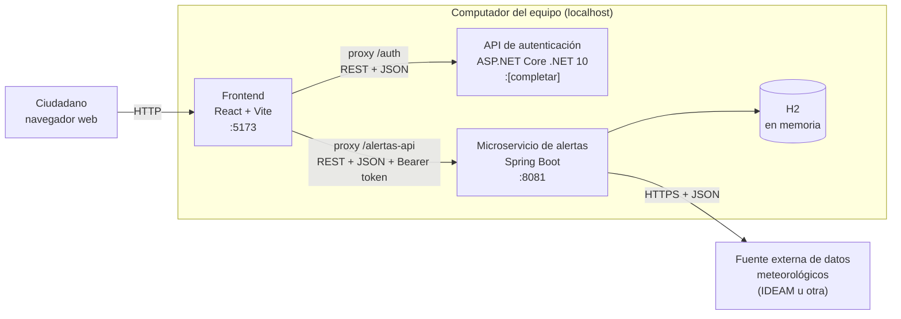

# Diseño de infraestructura

**Proyecto:** Sistema de Alertas Tempranas de Crecientes — Villavicencio
**Asignatura:** Telemática_I · Parcial I · 2026-II · Universidad de los Llanos
**Ubicación en el repositorio:** `docs/infraestructura.md`

---

## 1. Objetivo

Describir qué piezas de software componen el MVP, dónde se ejecuta cada una, en qué puerto, cómo se comunican y qué se necesita instalar para correrlas. Los valores marcados como **[completar]** se llenan cuando el equipo los verifique.

---

## 2. Vista general

El MVP se ejecuta en el computador del equipo como **tres procesos independientes**, más una fuente de datos externa.

Cada servicio tiene una sola responsabilidad y se puede arrancar, detener y reemplazar sin tocar a los demás. Esa separación es la que el PDF llama "microservices-oriented structure".

---

## 3. Componentes

| Componente | Tecnología | Responsabilidad | Puerto | Origen del código |
|---|---|---|---|---|
| Frontend | React + Vite | Pantalla de login y pantalla de alertas. No contiene lógica de negocio | 5173 | Carpeta `frontend/` de SisAlert |
| API de autenticación | ASP.NET Core (.NET 10) | Registrar usuarios, validar credenciales y emitir el token JWT | [completar: lo muestra la consola al ejecutar] | Repositorio `mini-identity-api-dotnet` (ya construida, se ejecuta sin modificar) |
| Microservicio de alertas | Java + Spring Boot | Zonas de riesgo, lecturas de lluvia y alertas | 8081 | Carpeta `alertas-service/` de SisAlert |
| Base de datos | H2 en memoria | Persistencia temporal de zonas, lecturas y alertas | (interna al microservicio) | Se embebe en `alertas-service` |
| Fuente externa | API o datos abiertos meteorológicos | Entregar datos de precipitación por estación | HTTPS | [completar en el Paso 4] |

El puerto 8081 se usa para el microservicio porque Spring Boot arranca por defecto en el 8080, y así se evitan choques con otras aplicaciones del computador.