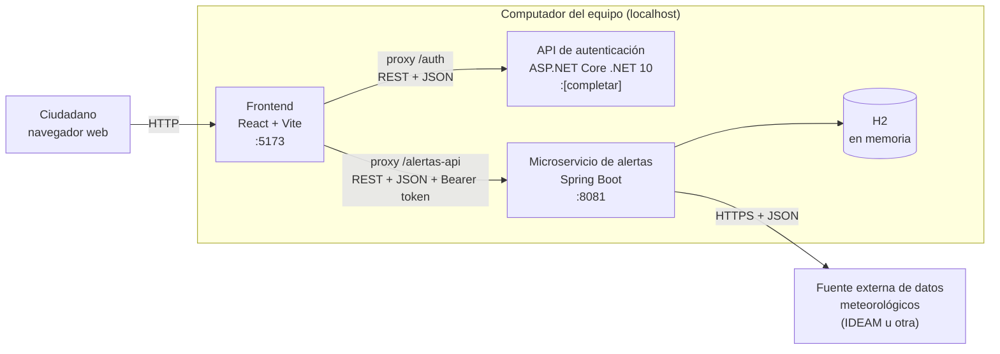

# Diseño de infraestructura

**Proyecto:** Sistema de Alertas Tempranas de Crecientes — Villavicencio
**Asignatura:** Telemática_I · Parcial I · 2026-II · Universidad de los Llanos
**Ubicación en el repositorio:** `docs/infraestructura.md`

---

## 1. Objetivo

Describir qué piezas de software componen el MVP, dónde se ejecuta cada una, en qué puerto, cómo se comunican y qué se necesita instalar para correrlas. Los valores marcados como **[completar]** se llenan cuando el equipo los verifique.

---

## 2. Vista general

El MVP se ejecuta en el computador del equipo como **tres procesos independientes**, más una fuente de datos externa.



Cada servicio tiene una sola responsabilidad y se puede arrancar, detener y reemplazar sin tocar a los demás. Esa separación es la que el PDF llama "microservices-oriented structure".

---

## 3. Componentes

| Componente | Tecnología | Responsabilidad | Puerto | Origen del código |
|---|---|---|---|---|
| Frontend | React + Vite | Pantalla de login y pantalla de alertas. No contiene lógica de negocio | 5173 | Carpeta `frontend/` de SisAlert |
| API de autenticación | ASP.NET Core (.NET 10) | Registrar usuarios, validar credenciales y emitir el token JWT | [completar: lo muestra la consola al ejecutar] | Repositorio `mini-identity-api-dotnet` (ya construida, se ejecuta sin modificar) |
| Microservicio de alertas | Java + Spring Boot | Zonas de riesgo, lecturas de lluvia y alertas | 8081 | Carpeta `alertas-service/` de SisAlert |
| Base de datos | H2 en memoria | Persistencia temporal de zonas, lecturas y alertas | (interna al microservicio) | Se embebe en `alertas-service` |
| Fuente externa | API o datos abiertos meteorológicos | Entregar datos de precipitación por estación | HTTPS | [completar en el Paso 4] |

El puerto 8081 se usa para el microservicio porque Spring Boot arranca por defecto en el 8080, y así se evitan choques con otras aplicaciones del computador.

---

## 4. Comunicación entre componentes

| Origen | Destino | Protocolo | Contenido | Cuándo |
|---|---|---|---|---|
| Navegador | Frontend | HTTP | Página web | Al abrir la aplicación |
| Frontend | API de autenticación | HTTP/REST, JSON | Usuario y contraseña; recibe el token JWT | Al iniciar sesión |
| Frontend | Microservicio de alertas | HTTP/REST, JSON | Consulta de alertas; petición de actualización. Lleva `Authorization: Bearer <token>` | Después del login |
| Microservicio de alertas | Fuente externa | HTTPS, JSON | Consulta de precipitación | Al pulsar "Actualizar datos" |
| Microservicio de alertas | H2 | Interno (JPA) | Lectura y escritura de datos | En cada operación |

### 4.1 Proxy del frontend (solución a CORS)

El navegador bloquea las llamadas entre orígenes distintos (por ejemplo, desde el puerto 5173 hacia otro puerto) si el servidor de destino no lo permite. Como la API de autenticación se usa sin modificarla, el frontend evita el problema haciendo que **el navegador solo hable con su propio origen** y que el servidor de desarrollo de Vite reenvíe las peticiones:

| Ruta que llama el navegador | Se reenvía a |
|---|---|
| `/auth/...` | `http://localhost:[puerto de la API de autenticación]/...` |
| `/alertas-api/...` | `http://localhost:8081/...` |

Ejemplos de cómo se traducen las rutas:

| El navegador llama a | El servicio recibe |
|---|---|
| `/auth/api/auth/login` | `POST /api/auth/login` en la API de autenticación |
| `/alertas-api/api/alertas` | `GET /api/alertas` en el microservicio de alertas |

Ejemplo de configuración en `frontend/vite.config.js`:

```js
export default {
  server: {
    proxy: {
      '/auth': {
        target: 'http://localhost:[PUERTO_AUTH]',
        changeOrigin: true,
        rewrite: (path) => path.replace(/^\/auth/, '')
      },
      '/alertas-api': {
        target: 'http://localhost:8081',
        changeOrigin: true,
        rewrite: (path) => path.replace(/^\/alertas-api/, '')
      }
    }
  }
}
```
> Si la API de autenticación solo escucha en HTTPS con certificado de desarrollo, añadir `secure: false` en su bloque. **[verificar al ejecutarla]**