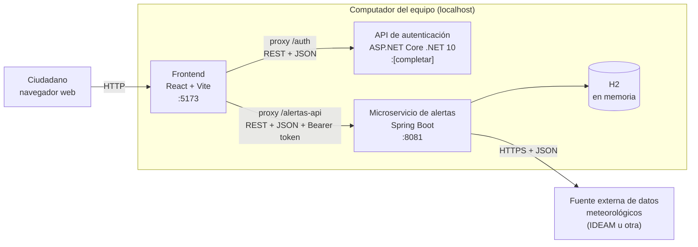

# Diseño de infraestructura

**Proyecto:** Sistema de Alertas Tempranas de Crecientes — Villavicencio
**Asignatura:** Telemática_I · Parcial I · 2026-II · Universidad de los Llanos
**Ubicación en el repositorio:** `docs/infraestructura.md`

---

## 1. Objetivo

Describir qué piezas de software componen el MVP, dónde se ejecuta cada una, en qué puerto, cómo se comunican y qué se necesita instalar para correrlas. Los valores marcados como **[completar]** se llenan cuando el equipo los verifique.

---

## 2. Vista general

El MVP se ejecuta en el computador del equipo como **tres procesos independientes**, más una fuente de datos externa.



Cada servicio tiene una sola responsabilidad y se puede arrancar, detener y reemplazar sin tocar a los demás. Esa separación es la que el PDF llama "microservices-oriented structure".

---

## 3. Componentes

| Componente | Tecnología | Responsabilidad | Puerto | Origen del código |
|---|---|---|---|---|
| Frontend | React + Vite | Pantalla de login y pantalla de alertas. No contiene lógica de negocio | 5173 | Carpeta `frontend/` de SisAlert |
| API de autenticación | ASP.NET Core (.NET 10) | Registrar usuarios, validar credenciales y emitir el token JWT | [completar: lo muestra la consola al ejecutar] | Repositorio `mini-identity-api-dotnet` (ya construida, se ejecuta sin modificar) |
| Microservicio de alertas | Java + Spring Boot | Zonas de riesgo, lecturas de lluvia y alertas | 8081 | Carpeta `alertas-service/` de SisAlert |
| Base de datos | H2 en memoria | Persistencia temporal de zonas, lecturas y alertas | (interna al microservicio) | Se embebe en `alertas-service` |
| Fuente externa | API o datos abiertos meteorológicos | Entregar datos de precipitación por estación | HTTPS | [completar en el Paso 4] |

El puerto 8081 se usa para el microservicio porque Spring Boot arranca por defecto en el 8080, y así se evitan choques con otras aplicaciones del computador.

---

## 4. Comunicación entre componentes

| Origen | Destino | Protocolo | Contenido | Cuándo |
|---|---|---|---|---|
| Navegador | Frontend | HTTP | Página web | Al abrir la aplicación |
| Frontend | API de autenticación | HTTP/REST, JSON | Usuario y contraseña; recibe el token JWT | Al iniciar sesión |
| Frontend | Microservicio de alertas | HTTP/REST, JSON | Consulta de alertas; petición de actualización. Lleva `Authorization: Bearer <token>` | Después del login |
| Microservicio de alertas | Fuente externa | HTTPS, JSON | Consulta de precipitación | Al pulsar "Actualizar datos" |
| Microservicio de alertas | H2 | Interno (JPA) | Lectura y escritura de datos | En cada operación |

### 4.1 Proxy del frontend (solución a CORS)

El navegador bloquea las llamadas entre orígenes distintos (por ejemplo, desde el puerto 5173 hacia otro puerto) si el servidor de destino no lo permite. Como la API de autenticación se usa sin modificarla, el frontend evita el problema haciendo que **el navegador solo hable con su propio origen** y que el servidor de desarrollo de Vite reenvíe las peticiones:

| Ruta que llama el navegador | Se reenvía a |
|---|---|
| `/auth/...` | `http://localhost:[puerto de la API de autenticación]/...` |
| `/alertas-api/...` | `http://localhost:8081/...` |

Ejemplos de cómo se traducen las rutas:

| El navegador llama a | El servicio recibe |
|---|---|
| `/auth/api/auth/login` | `POST /api/auth/login` en la API de autenticación |
| `/alertas-api/api/alertas` | `GET /api/alertas` en el microservicio de alertas |

Ejemplo de configuración en `frontend/vite.config.js`:

```js
export default {
  server: {
    proxy: {
      '/auth': {
        target: 'http://localhost:[PUERTO_AUTH]',
        changeOrigin: true,
        rewrite: (path) => path.replace(/^\/auth/, '')
      },
      '/alertas-api': {
        target: 'http://localhost:8081',
        changeOrigin: true,
        rewrite: (path) => path.replace(/^\/alertas-api/, '')
      }
    }
  }
}
```
> Si la API de autenticación solo escucha en HTTPS con certificado de desarrollo, añadir `secure: false` en su bloque. **[verificar al ejecutarla]**

---

## 5. Ambiente de ejecución

### 5.1 Requisitos instalados

| Herramienta | Versión | Para qué |
|---|---|---|
| Git | Reciente | Control de versiones |
| .NET SDK | 10 | Ejecutar la API de autenticación |
| JDK | 17 o superior | Ejecutar el microservicio de alertas |
| Maven o Gradle | Según el proyecto | Compilar el microservicio (puede usarse el wrapper incluido) |
| Node.js | LTS | Ejecutar el frontend |

### 5.2 Orden de arranque

1. **API de autenticación** (`dotnet run`). Registrar el usuario de prueba, porque sus datos están en memoria y se pierden al reiniciar.
2. **Microservicio de alertas** (Maven o Gradle). Al iniciar carga las zonas de ejemplo en H2.
3. **Frontend** (`npm install` la primera vez y luego `npm run dev`). Abrir `http://localhost:5173`.

Los comandos exactos se documentan en el `README.md` del repositorio.

---

## 6. Persistencia

| Servicio | Almacenamiento | Consecuencia |
|---|---|---|
| API de autenticación | Memoria propia del proceso | Al reiniciarla se pierden los usuarios; hay que registrarlos de nuevo |
| Microservicio de alertas | H2 en memoria (`jdbc:h2:mem:alertasdb`) | Al reiniciarlo se pierden lecturas y alertas; las zonas se recargan al arrancar |

Se elige memoria porque el PDF la contempla como opcional y el objetivo es un MVP funcional, no un sistema de producción. Cada servicio tiene su propio almacenamiento: **ningún servicio lee los datos de otro**, solo se comunican por REST.

---

## 7. Seguridad básica del MVP

- La autenticación la resuelve la API de autenticación con token JWT.
- El frontend guarda el token en `sessionStorage` y lo envía en el encabezado `Authorization` a partir del login.
- No se guardan contraseñas ni claves de servicios externos en el repositorio. Si la fuente externa requiere una clave, se lee desde una variable de entorno.
- El microservicio de alertas **no valida el token** en esta etapa; el PDF no lo exige. Queda como mejora para la entrega final.

---

## 8. Decisiones y justificación

| Decisión | Justificación |
|---|---|
| Tres procesos separados | Muestra separación de responsabilidades entre cliente, autenticación y dominio |
| Comunicación HTTP/REST con JSON | Es lo que sugiere el PDF y todas las tecnologías del equipo lo soportan |
| Proxy en el frontend | Evita modificar la API de autenticación provista |
| H2 en memoria | Cero instalación y suficiente para el MVP |
| Ejecución local sin contenedores | El PDF permite demostrar "localmente o desplegado"; Docker y despliegue en nube quedan fuera del alcance |
| Consulta a la fuente externa solo bajo demanda | Simplifica el MVP; no hay tareas programadas |

---

## 9. Limitaciones conocidas

- Si la fuente externa no responde, el microservicio devuelve un error controlado y conserva las alertas existentes.
- Sin usuarios ni alertas persistentes entre reinicios.
- No hay despliegue en servidor; la demostración es local.

---

## 10. Lista de verificación

- [ ] Puerto de la API de autenticación confirmado y anotado
- [ ] Fuente externa elegida y anotada (Paso 4)
- [ ] Versiones de .NET, JDK y Node confirmadas en los computadores del equipo
- [ ] Proxy del frontend probado (login desde el navegador sin errores de CORS)
- [ ] Documento revisado por al menos otro integrante