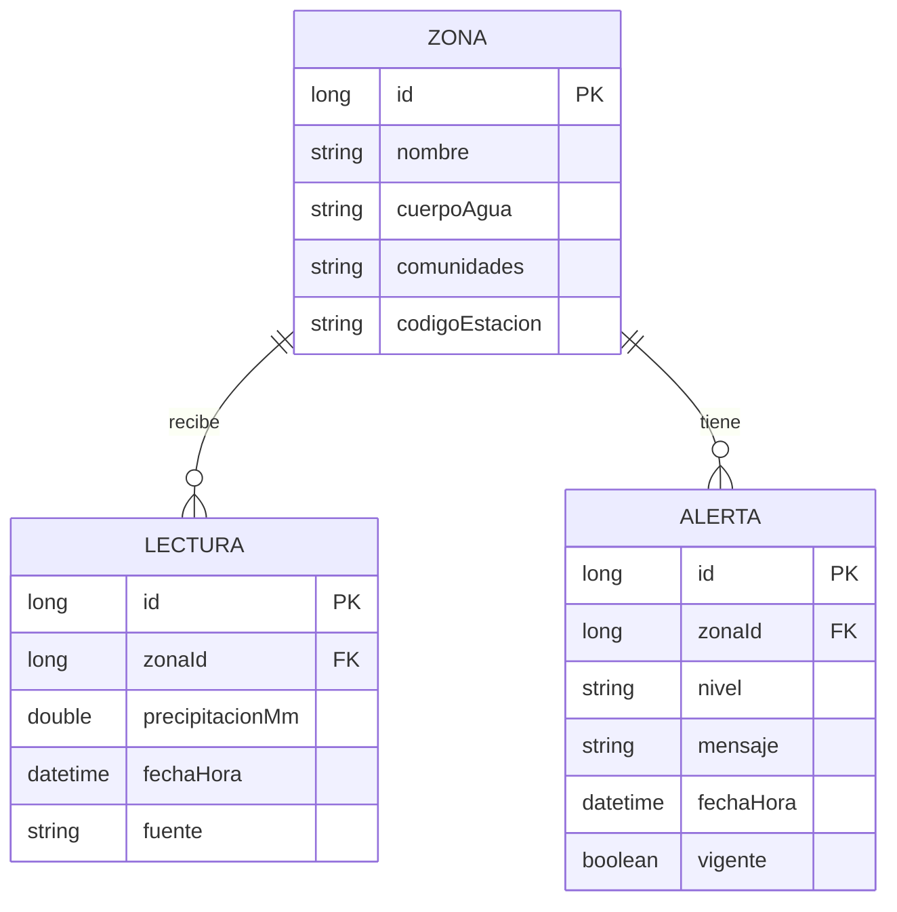

# Diseño del modelo de datos

**Proyecto:** Sistema de Alertas Tempranas de Crecientes — Villavicencio
**Asignatura:** Telemática I· Parcial I · 2026-II · Universidad de los Llanos
**Ubicación en el repositorio:** `docs/modelo-datos.md`

---

## 1. Objetivo

Definir qué información guarda el microservicio de alertas, cómo se relacionan sus tablas y qué reglas cumplen los datos. Los valores marcados como **[completar]** se cierran en el Paso 4.

**Alcance:** este modelo pertenece únicamente al microservicio de alertas (base H2 en memoria). Los usuarios y contraseñas los administra la API de autenticación con su propio almacenamiento; el microservicio de alertas no los guarda ni los lee.

---

## 2. Diagrama entidad-relación



Lectura del diagrama: una zona puede tener muchas lecturas y muchas alertas (a lo largo del tiempo); cada lectura y cada alerta pertenece a una sola zona.

---

## 3. Descripción de las tablas

### 3.1 ZONA

Sector de la ciudad asociado a un río o caño, con las comunidades que se ven afectadas y la estación meteorológica que se usa como referencia.

| Columna | Tipo | Obligatoria | Descripción |
|---|---|---|---|
| `id` | Long | Sí | Identificador, generado automáticamente |
| `nombre` | Texto (100) | Sí | Nombre de la zona. Único |
| `cuerpoAgua` | Texto (100) | Sí | Río o caño que genera el riesgo |
| `comunidades` | Texto (255) | Sí | Barrios o comunidades cercanas, separados por comas |
| `codigoEstacion` | Texto (50) | Sí | Código de la estación de referencia en la fuente de datos |

### 3.2 LECTURA

Dato de precipitación obtenido de la fuente externa para una zona en un momento dado. Es un registro histórico: **nunca se modifica**, solo se agregan lecturas nuevas.

| Columna | Tipo | Obligatoria | Descripción |
|---|---|---|---|
| `id` | Long | Sí | Identificador, generado automáticamente |
| `zonaId` | Long | Sí | Zona a la que pertenece (clave foránea a `ZONA`) |
| `precipitacionMm` | Decimal | Sí | Lluvia acumulada del día, en milímetros. Debe ser mayor o igual a 0 |
| `fechaHora` | Fecha y hora | Sí | Momento de la medición según la fuente |
| `fuente` | Texto (50) | Sí | Nombre de la fuente de datos (por ejemplo, IDEAM) |

### 3.3 ALERTA

Resultado de evaluar la lectura de una zona con la regla de umbral.

| Columna | Tipo | Obligatoria | Descripción |
|---|---|---|---|
| `id` | Long | Sí | Identificador, generado automáticamente |
| `zonaId` | Long | Sí | Zona a la que pertenece (clave foránea a `ZONA`) |
| `nivel` | Texto (20) | Sí | `NORMAL`, `PRECAUCION` o `PELIGRO` |
| `mensaje` | Texto (255) | Sí | Mensaje para el ciudadano asociado al nivel |
| `fechaHora` | Fecha y hora | Sí | Momento en que se generó la alerta |
| `vigente` | Booleano | Sí | `true` si es la alerta actual de la zona; `false` si fue reemplazada |

---

## 4. Relaciones e integridad

| Relación | Cardinalidad | Regla |
|---|---|---|
| ZONA → LECTURA | Uno a muchos | No puede existir una lectura sin zona |
| ZONA → ALERTA | Uno a muchos | No puede existir una alerta sin zona |

Restricciones de la base de datos:

- `ZONA.nombre` es único.
- Las columnas marcadas como obligatorias no admiten valores nulos.
- `LECTURA.precipitacionMm` no puede ser negativa.

---

## 5. Reglas de negocio sobre los datos

1. **Una sola alerta vigente por zona.** Cuando se genera una alerta nueva, la anterior de esa zona pasa a `vigente = false`. Esta regla la aplica el servicio, no la base de datos.
2. **Las lecturas y las alertas no se borran ni se editan** durante la ejecución; así se conserva el recorrido de lo ocurrido mientras el servicio esté encendido.
3. **Una zona sin alerta vigente se muestra como "Sin datos"** en el frontend; no se crea una alerta artificial.
4. **El nivel se guarda como texto** (`NORMAL`, `PRECAUCION`, `PELIGRO`) y no como número, para que sea legible en la base y coincida con lo que recibe el frontend.
5. **Los umbrales de lluvia no se guardan en la base de datos**; se leen de la configuración (`application.properties`).

---

## 6. Datos iniciales

Al arrancar, el servicio carga entre 3 y 4 zonas de ejemplo. Las lecturas y alertas comienzan vacías.

| Nombre de la zona | Cuerpo de agua | Comunidades | Código de estación |
|---|---|---|---|
| [completar] | [completar] | [completar] | [completar] |
| [completar] | [completar] | [completar] | [completar] |
| [completar] | [completar] | [completar] | [completar] |

Las zonas reales de Villavicencio y las estaciones de referencia se definen en el Paso 4, cuando se elija la fuente de datos.

---

## 7. Correspondencia con el código

Cada tabla se representa con una entidad JPA en el paquete `model` del microservicio. Ejemplo de la entidad `Alerta`:

```java
@Entity
public class Alerta {

    @Id
    @GeneratedValue(strategy = GenerationType.IDENTITY)
    private Long id;

    @ManyToOne(optional = false)
    private Zona zona;

    @Enumerated(EnumType.STRING)
    @Column(nullable = false, length = 20)
    private NivelAlerta nivel;          // NORMAL, PRECAUCION, PELIGRO

    @Column(nullable = false)
    private String mensaje;

    @Column(nullable = false)
    private LocalDateTime fechaHora;

    @Column(nullable = false)
    private boolean vigente;

    // constructores, getters y setters
}
```

`NivelAlerta` es una enumeración con los tres valores. `Zona` y `Lectura` siguen el mismo patrón.

---

## 8. Configuración de H2

En `alertas-service/src/main/resources/application.properties`:

```properties
server.port=8081

spring.datasource.url=jdbc:h2:mem:alertasdb
spring.datasource.driver-class-name=org.h2.Driver
spring.datasource.username=sa
spring.datasource.password=

spring.jpa.hibernate.ddl-auto=create-drop
spring.h2.console.enabled=true
spring.h2.console.path=/h2-console
```

- `mem:alertasdb` indica que la base vive en memoria y se pierde al apagar el servicio.
- `create-drop` crea las tablas al arrancar a partir de las entidades y las elimina al apagar.
- La consola de H2 queda disponible en `http://localhost:8081/h2-console`. Sirve para mostrar las tablas durante la demostración y para depurar. Se usa solo en desarrollo.

---

## 9. Decisiones y justificación

| Decisión | Justificación |
|---|---|
| Tres tablas | Es el mínimo que separa la configuración (zona), el dato medido (lectura) y el resultado (alerta) |
| Lecturas y alertas como registros separados | La lectura es un hecho externo; la alerta es una decisión del sistema. Separarlas permite explicar de dónde salió cada alerta |
| Alertas que se reemplazan, no se actualizan | Conserva lo que ocurrió durante la ejecución sin agregar una tabla de historial |
| `comunidades` como texto simple | Suficiente para el MVP; una tabla de comunidades añadiría complejidad que el parcial no pide |
| `nivel` como texto | Legible en la base y compatible con lo que consume el frontend |
| Umbrales fuera de la base de datos | Se ajustan por configuración sin recompilar |
| H2 en memoria con `create-drop` | Cero instalación y el PDF contempla la persistencia en memoria como opcional |
| Modelo propio del microservicio | Ningún servicio lee los datos de otro; los usuarios quedan en la API de autenticación |

---

## 10. Lista de verificación

- [ ] Diagrama y descripción de tablas revisados por quien construye el microservicio
- [ ] Campos coherentes con las respuestas JSON de `docs/aplicacion.md`
- [ ] Zonas y estaciones de ejemplo definidas (Paso 4)
- [ ] Entidades JPA creadas a partir de este documento
- [ ] Tablas visibles en la consola de H2
- [ ] Documento revisado por al menos otro integrante